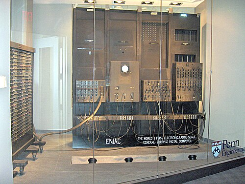
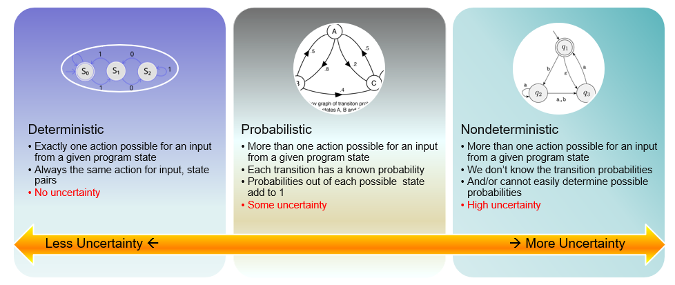

<!-- class: lead -->
<!-- _backgroundImage: url('images/title-bg.jpg') -->
# Software Architecture for Essential & Accidental Uncertainty

**Neil Harrison**, **George Rudolph** (presenter), **Peter Aldous**  
Utah Valley University
Orem, Utah

---

## &nbsp; Introduction: A Bit of History

**ENIAC** — Electronic Numerical Integrator and Computer  
First general-purpose computer built to solve *a large class of numerical problems*.  1945-1955

 -  Fisrt computer to run at electronic speed
 - Killed by lightning strik in 1955
 - Early problems were **precisely specified**: inputs, algorithms, outputs, ...
 - Results were deterministically computed

---

## Progress

- Original computing tackled precisely-defined **mathematical problems**
- Over time, capabilities expanded to **business applications, data communication, control systems, and AI**
    - inputs, outputs, and processes became more varied, less precise.
    - an artifact of modeling non-mathematical problems via mathematical abstractions
- We must now deal with uncertainty — and understand how to approach it in architecture and design.

---

## Current State of the Art

- (2010) **David Garlan** called for uncertainty to be a first‑class concern in software design and development.
- Current research and practice focus on **fault tolerance** and related tactics.
- **This misses a large part of uncertainty** and motivates a deeper investigation.

---

## &nbsp; Essence vs. Accident (Brooks, 1986)

**Accidental complexity**: created by engineering choices, mitigated by better tools and abstractions.  
**Essential complexity**: inherent in the problem — cannot be removed.  

Likewise, there is essential and accidental uncertainty.

---

## Essential and Accidental Uncertainty

- **Accidental uncertainty**: can be separated from the problem; *a transformation exists* to remove it.
- **Essential uncertainty**: must be addressed as part of the problem; *no transformation* can remove it.

---

## Uncertainty and Data

Computing is the **processing of data**. Consider uncertainty across:

- **Input** (can be essential or accidental)
- **Transformation** from input to output (can be essential or accidental)
- **Output** (often essential)

---

## Input: Uncertainty Examples

- **Unreliable data transmission** — Accidental; datacomm protocols implement transformations to remove uncertainty
- **Amount of data** — Often accidental; handle in subsets
- **User input errors** — Accidental; parse for correctness and re-prompt
- **Multiple concurrent access** — Accidental if handled discretely; **Essential** if not (e.g., venue ticket website, requests for the *same* seat)

---

<!-- _class: slide9 -->
## &nbsp; Uncertainty in the Transformation (Algorithms)

The **algorithm or processing logic** that transforms input to output can *introduce* uncertainty

  

    <ul>
      <li><strong>Accidental</strong> → can be fixed
        <ul>
          <li>Hardware glitches</li>
          <li>compiler differences</li>
          <li>implementation bugs</li>
        </ul>
      </li>
      <li><strong>Essential</strong>
        <ul>
          <li>No deterministic algorithm exists to compute correct output</li>
          <li>Example: Image recognition</li>
        </ul>
      </li>
    </ul>
  

  

    <ul>
      <li><strong>Essential (intractable)</strong>
        <ul>
          <li>Algorithm is computationally infeasible</li>
          <li>approximations introduce uncertainty in accuracy/precision</li>
          <li>Examples: Game of Go, optimization problems</li>
        </ul>
      </li>
    </ul>
  

**Critical insight**: Essential transformation uncertainty often reflects **uncertain output** — requires probabilistic or AI-based approaches

---

## Output Uncertainty

- *Accidental* output uncertainty is generally less architecurally interesting.
- **Essential output uncertainty** spans a wide spectrum — requires a corresponding spectrum of architectural approaches.

---

## &nbsp; Essential Output Uncertainties

| Output characteristics | Example |
|---|---|
| There is a known right answer | Mathematical computation |
| The right answer(s) can be known | Sales website (How well did a product sell?) |
| Right answer exists but is infeasible to compute directly | Game of Go (astronomical state space) |
| Unknown right answer; we can **guess** | Image recognition |
| Effect is unknown, but can be measured | Optimization problems |
| Effect is unknown; system is **chaotic** | Weather forecasting |
| No specific answer, but can observe "right" direction | Advertising; many simulation problems |
| No single right answer; the problem is **vague** | Automated prose writing |
| The problem itself is unknown | Grounded theory |

---

## Thought Question

How would you characterize **automatic software coding**?

> Trick: It depends on the nature of the software.  
> If you cannot precisely specify what the generated software should do, **how can you verify it?**

> Generative AI makes good answers at once more vital and more complex

---

## Spectrum of Uncertainty

---

## Architectural Approaches

Different levels and characteristics of uncertainty suggest different architectural styles, patterns, and tactics

- **Virtually no uncertainty** → Batch processing
- **Accidental uncertainty** → Pipes & Filters; Layers; Broker
- **Greater essential uncertainty** → AI‑based approaches
  - Blackboard
  - Neural networks
  - Machine learning / deep learning

---

## Spectrum of Architectural Approaches

- If the main rotor is not perfectly balanced, excess **vibration** occurs.  
- Vibration causes **wear**, **loss of power**, and can compromise **safety**.  
- The rotor is a complex system with multiple **adjustment points**.

---

## Uncertainty Analysis — Input (Rotor)

- Input is **known and precisely measured**: vibration measurements; blade positions; adjustment points.  
- **User entry errors** → external; apply standard Fault Tolerance techniques (to correct accidental uncertainty)
- Each helicopter has **unique**  wear patterns → *essential*; must be considered.

---

## Uncertainty Analysis — Output (Rotor)

- Objective measurable: **change in vibration** (IPS — inches per second).  
- Desired output is a **range** (lower is better).  
- Acceptable standard: **0.5 IPS**.  
- Single solution? There may be **different sequences** of adjustments achieving the goal.

---

## Uncertainty Analysis — Processing (Rotor)

- Is the relationship between input and output **deterministic**? Initially **unknown**.  
- Combinations of adjustments appeared **non‑deterministic** / **chaotic**.  
- *Initial* Approach: use a **neural network** to derive suggested solutions.

---

## Further Analysis (Rotor)

- **Unique wear profile** for each helicopter.  
- Initial NN trained on **many helicopters** → a **generic** approximation.  
- **Adjustment/response history** of testing reveals unique profiles.  
- **Intermediate Result**: There exists a **deterministic, repeatable** sequence of adjustments with **feedback loops**.
  - details are proprietary

---

## Relevant Results

- System reliably balances main rotors to **0.05 IPS** — *10× better* than the standard.  
- Actively marketed to **US Army** and other organizations.  
- Demonstrates the importance of understanding **essential vs. accidental** uncertainty.
  - to choose the right architectural approach

---

## Case Study: Online Bookstore

- **Initially**: Inputs/outputs well‑specified; numerous **accidental uncertainties** (e.g., unreliable networks).  
- Straightforward architecture.

---

## Bookstore Evolution — Related Books

- Add **“related books”** feature.  
- Which books are **related**? An **essential uncertainty** — output cannot be known beforehand, no single right answer.  
- Approaches become **probabilistic**.

---

## Bookstore Evolution — Promotions

- Use **browsing history** to promote products.  
- Even **more uncertainty**; the problem is less well‑defined.  
- Consider **machine learning**; map to the uncertainty **spectrum**.
- recommendation engines are a popular, common solution.

---

## References

- Harrison, N.B., Rudolph, G., and Aldous, P. *Software Architecture for Essential and Accidental Uncertainty*. HICSS, 2026.  
- Harrison, N.B., Rudolph, G., and Aldous, P. *Is Artificial Intelligence the Answer to Everything?* Intermountain Conference on Engineering, Technology and Computing (IETC), 2025.

---

<!-- Last slide: remove background to be plain -->
<!-- _backgroundImage: none -->
# Thank you!

Questions?

