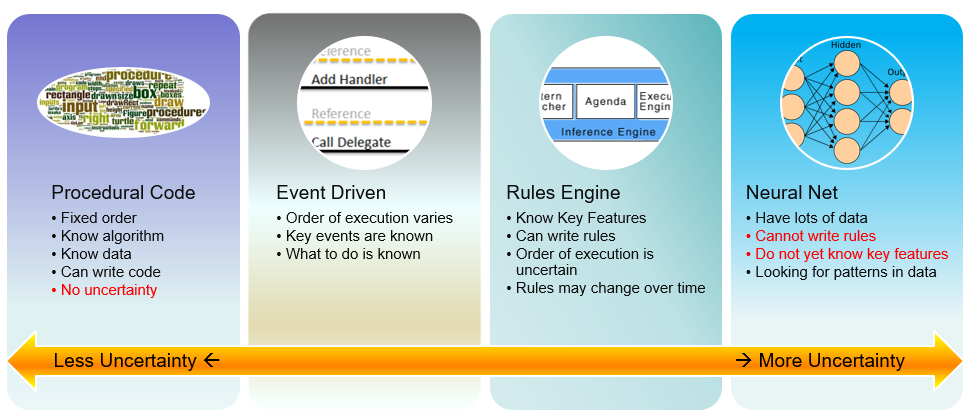
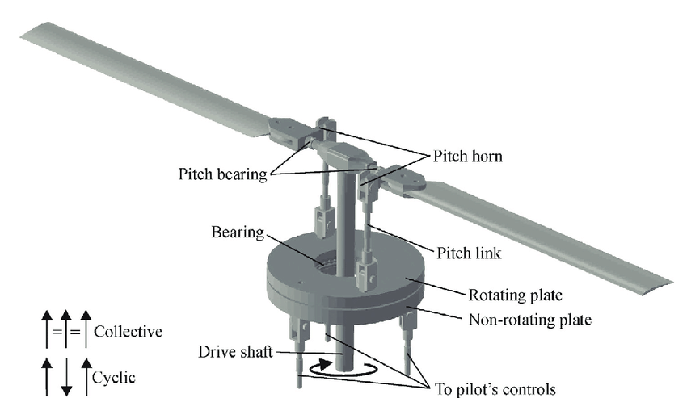

<!-- Title slide: override background to title image -->
<!-- _backgroundImage: url('assests/backgound_title.jpg') -->

# Software Architecture for Essential and Accidental Uncertainty

# George Rudolph
Neil Harrison, Peter Aldous
Utah Valley University

presented at HICSS-59
Jan 6-9, 2026 Maui, HI

---

# Introduction: A bit of History

The ENIAC:  Electronic Numerical Integrator and Computer

First general\-purpose computer to solve “a large class of numerical problems”

problems were precisely defined

results could be deterministically computed

---

# Progress: More Applications

__Business Applications__

Variation in amount and nature of input data

__Data Communication__

Data transmission issues: timing\, failure\, corruption\,\.\.\.

__Control Systems__

Must handle all different problems reliably/robustly

__Artificial Intelligence__

Unknown inputs\, unknown outputs

---

# History: Summary

* Original problems solved by computers were mathematical
  *  _precisely _   _specified_
  *  _precisely _   _defined outputs_
  *  _precisely _   _defined algorithms_
  * even if you didn’t know the exact answer yet
* As software capabilities increase
  * the inputs\, outputs\, and even processing approaches have become less precise
  * we must deal with uncertainty
* Therefore\, it is  necessary  to  understand   uncertainty \, and how to  approach  it

---

# Current State of the Art

* 2010 David Garlan: uncertainty should be a first\-class concern in software design and development
  * He was late to the party\.\.\.
* Uncertainty research and practice is ENTIRELY focused on
  * fault tolerance and
  * similar approaches

---

# What This Misses

 __misses __   __a large part of __   __uncertainty__ 

demands an in\-depth investigation of the  nature of uncertainty

---

# Yet more history

* Frederick ​P\. Brooks 1986: “No Silver Bullet: Essence and Accidents in Software Engineering”
*  __Accidental__   __ Complexity__ : problems that engineers create and fix\.
  * modern programming languages abstract away writing and optimizing assembly language code\.
*  __Essential __   __Complexity__ : is caused by the problem to be solved\, and nothing can remove it
  * users want a program to do 30 different things\. those 30 things are essential and the program must do those 30 different things\.
* Likewise\, there is   __essential __  and  accidental    __uncertainty__  \.

---

# Essential and Accidental Uncertainty

__Accidental uncertainty__ : Uncertainty that can be separated from the problem at hand\. There exists a transformation that removes the uncertainty\.

__Essential uncertainty__ : Uncertainty that must be addressed as part of the problem\. No transformation can exist that removes the uncertainty from the problem\.

---

# Uncertainty and Data

* Uncertainty can be characterized by considering the  __data__  of a system
  * After all\, computing is processing of data
* Consider the following
  * Uncertainty of the input \(can be essential or accidental\)
  * Uncertainty of the output \(generally essential\)
  * Uncertainty in the transformation from input to output \(can be essential or accidental\)

---

# Input: Uncertainty Examples

* Unreliable data transmission:
  * Accidental\, because not part of the essence of the data\. Datacomm protocols implement transformations to remove the uncertainty
* Amount of data being processed:
  * Often accidental\, because we can often handle it in subsets
* User input errors
  * Accidental: parse for correctness and re\-prompt
* Multiple concurrent access to the system
  * Accidental\, if we can handle the discretely
  * Essential\, if not \(e\.g\.\, a venue ticket website\, requests for the same seat\)

---

# Input Uncertainty

Other cases of input uncertainty exist that are essential\.

We will discuss these later

---

# Uncertainty in the Transformation

* By itself\, it is generally kind of accidental\.
* Examples:
  * Hardware glitches during processing: accidental\, approaches include duplication of hardware
  * Different compilers produce different programs that do the same thing: we generally don’t care if differences in performance don't become an issue
* The  interesting  cases are associated with  output uncertainty

---

# Output Uncertainty

Accidental uncertainty of output is generally not very interesting

Essential output uncertainty spans a wide spectrum of the nature of the uncertainty

Requires a corresponding spectrum of architectural and design approaches

---

# Essential Output Uncertainties

| Output Characteristics | Example |
| :-: | :-: |
| There is a known right answer | Mathematical computation |
| The right answer\(s\) can be known | Sales Website \(how well did a product sell?\) |
| There is a right answer\, but is infeasible to compute directly | Game of Go \(estimated  __10^10^48 to 10^10^170 possible games\)__ |
| Unknown right answer\, but can guess | Image recognition |

---

# More …

| Output Characteristics | Example |
| :-: | :-: |
| The effect is unknown\, but can be measured | Optimization problems |
| The effect is unknown; the system is chaotic | Weather forecasting |
| No specific answer\, but can observe “right” or “wrong” direction | Advertising\, many simulation problems |
| No single right answer\, and the problem is vague | Automated prose writing |
| The problem itself is unknown | Grounded theory |

---

# Thought Exercise

* Q: How would you characterize automatic software coding?
* A: it’s a trick question\. It depends on the nature of the software being written\.
* Q: Can you precisely specify what the generated software should do?
  * Point:  If not \, how in the world can you  verify  it???

---

# Spectrum of Uncertainty

---

# Architectural Approaches

* Different levels and characteristics of uncertainty suggest different architectural approaches\, including patterns\, styles\, and tactics
* Virtually no uncertainty: Batch processing
* Pipes and Filters\, Layers\, Broker: well\-suited for certain types of accidental uncertainty
* Greater essential uncertainty leads to AI\-based approaches
  * Blackboard
  * Neural network
  * Machine learning\, deep learning

---

# Spectrum of Architectural Approaches

---

# An Architecture Process for Uncertainty

* Identify the uncertainties associated with the system
* For each\, determine if it is essential or accidental
  * Study the source of the uncertainty \(external is usually accidental\)
  * Determine if there is a transformation to remove the uncertainty
  * If so\, use techniques such as fault tolerance

---

# 3. Analyze Uncertainties

__Analysis of the Input Data:__

It is because of imprecise/incomplete specification?

It is because if variability in the data \(such as transmission\, user input errors\, etc\.\)?

What can and cannot be known about the data at runtime?

---

__Analysis of the Output Data__

What is the objective of the system? How can we know if it meets its objective?

Is there a known correct output?

Is there a correct output\, but we cannot know if it is correct?

Can the output be correctly and deterministically derived from the inputs?

Are there multiple correct outputs?

If there are multiple correct outputs\, is one more preferred than others?

---

__Analysis of Transformation from Input to Output__

Is the relationship between input and output deterministic?

If it is deterministic\, is it tractable?

---

# Case Study (Real Life)

Helicopter Rotor Balancing

If the main rotor of a helicopter is not perfectly balanced\, it causes excess vibration

Vibration causes excess wear\, loss of power\, and even compromised safety

The main rotor is a complex system\, with several different adjustment points\.

---

---

# Uncertainty Analysis: Input

* Input is known\, and precisely specified:
  * Vibration of the rotor can be precisely measured
  * Positions of blades and adjustment points
  * History of adjustments/response  \(\!\) \(was missed\!\)
* Uncertainty: possible user error in entering data
  * External: consider standard FT techniques
* Uncertainty: each helicopter has unique wear patterns
  * \(Key\! But was not considered\!\)

---

# Uncertainty Analysis: Output

* Overall objective known and can be measured: how much did the vibration change?
* Desired output is a range: lower vibration is better\, of course\.
  * Standard of acceptable vibration \(0\.5 IPS\, inches per second\)
* Single solution? There may be different sets or sequences of adjustments to achieve the goal\.

---

# Uncertainty Analysis: Processing

* Is the relationship between input and output deterministic?
  * Unknown\!
  * Combinations of adjustments did not appear to deterministically result in reduced vibration
  * System  appeared  to be  chaotic \.
* Conclusion:
  * Use a neural network to derive a suggested solution\.

---

However:

The analysis had not fully considered all the aspects of the input\, output\, and processing\!

Individual differences of each helicopter

History of adjustments and responses

---

# Further Analysis Revealed...

* Each helicopter has a  unique  wear  profile
  * Neural network approach was based on  many samples  from  many different helicopters
  * Result:  generic approximation
* The adjustment/response history reveals the unique profile
* There is a  sequence  of adjustments that is  deterministic  and  repeatable
  * Employs feedback loops
  * Other details are proprietary

---

# Results

System can reliably balance main rotors to 0\.05 IPS\,  10x better  than the standard\.

System is actively being marketed to US Army and other governmental and private organizations\.

Demonstrates  the importance and effectiveness of understanding the  essential  and  accidental  uncertainty of a system

---

# Case Study: Online Bookstore

* Initially:
* Input and output analysis:
  * Input and output well specified\.
  * Numerous accidental uncertainties\, such as unreliability of the network\.
* Straightforward

---

# Case Study: Bookstore evolution

* Add a “related books” feature
  * Which books are related to the selected book?
  * An essential uncertainty
  * Output cannot be known beforehand
  * Not one single right answer
  * Approaches are not deterministic\, but are probabilistic

---

* Examine browsing history to promote products
  * Even more uncertainty
  * Problem is less well defined
  * Consider machine learning
* See uncertainty spectrum as discussed earlier

---

__References__

Harrison\, N\.B\.\, Rudolph\, G\.\, and Aldous\, P\. Software Architecture for Essential and Accidental Uncertainty\, Hawaii International Conference on the System Sciences \(HICSS\)\, 2026\.

Harrison\, N\.B\.\, Rudolph\, G\.\, and Aldous\, P\. Is Artificial Intelligence the Answer to Everything?\, 2025 Intermountain Conference on Engineering\, Technology and Computing \(IETC\)\, 2025\.

---

# Thank you!

# Questions?

